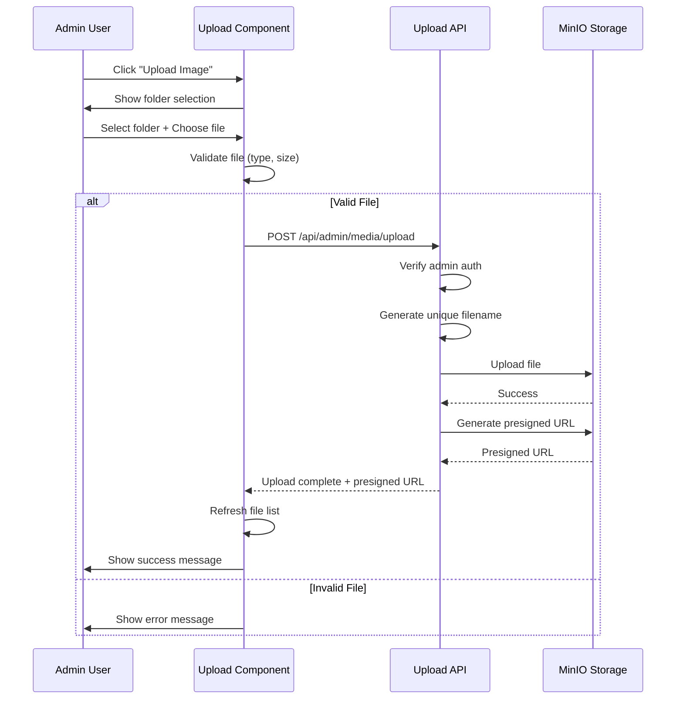
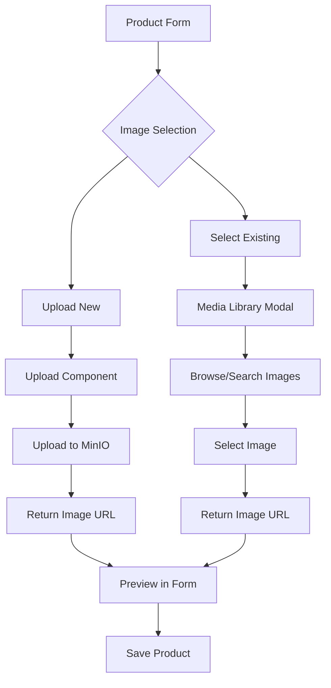

# Phase 14.6: Upload Image Feature

**Status:** 📋 PLANNED (Not Yet Implemented)  
**Date:** October 17, 2025  
**Type:** New Feature - File Upload

---

## Overview

Add upload functionality to the Media Library, allowing admins to upload images from their device. This completes the full CRUD operations (Create, Read, Update, Delete) for the Media Library.

---

## Goals

1. 🎯 Create upload API endpoint with folder selection
2. 🎯 Build upload UI component with drag-and-drop
3. 🎯 Add file validation (type, size, dimensions)
4. 🎯 Show upload progress indicator
5. 🎯 Support multiple file uploads
6. 🎯 Integrate with product/category forms
7. 🎯 Add "Select from Media Library" option in forms

---

## User Stories

### Story 1: Admin Uploads Image
```
As an admin
I want to upload images to the Media Library
So that I can use them for products and categories
```

**Acceptance Criteria:**
- [ ] Upload button visible in Media Library
- [ ] Can select folder (products/categories/general)
- [ ] Can drag & drop files
- [ ] See upload progress
- [ ] See success/error messages
- [ ] Uploaded image appears in list immediately

### Story 2: Upload from Product Form
```
As an admin
I want to select images when creating products
So that I don't have to upload separately
```

**Acceptance Criteria:**
- [ ] Product form has image selection
- [ ] Can upload new image OR select existing
- [ ] Modal shows Media Library for selection
- [ ] Selected image preview in form
- [ ] Can change/remove selected image

---

## Architecture

### Upload Flow



### Product Form Integration



---

## API Endpoint

### Upload Single File

**Endpoint:** `POST /api/admin/media/upload`

**Request:**
```typescript
Content-Type: multipart/form-data

{
  file: File              // Image file
  folder: 'products' | 'categories' | 'general'
  overwrite?: boolean     // Optional: overwrite if exists
}
```

**Response (Success):**
```json
{
  "success": true,
  "file": {
    "key": "products/brake-pad-1699123456789.jpg",
    "url": "http://localhost:9000/garritwulf-media/products/brake-pad-1699123456789.jpg?X-Amz-...",
    "size": 45678,
    "sizeFormatted": "44.61 KB",
    "contentType": "image/jpeg",
    "isImage": true,
    "uploadedAt": "2025-10-17T12:34:56.789Z"
  },
  "message": "File uploaded successfully"
}
```

**Response (Error):**
```json
{
  "success": false,
  "error": "File size exceeds maximum allowed (5MB)"
}
```

### Upload Multiple Files

**Endpoint:** `POST /api/admin/media/upload-multiple`

**Request:**
```typescript
Content-Type: multipart/form-data

{
  files: File[]           // Array of files
  folder: 'products' | 'categories' | 'general'
}
```

**Response:**
```json
{
  "success": true,
  "uploaded": 3,
  "failed": 0,
  "files": [
    { "key": "products/file1.jpg", "url": "...", ... },
    { "key": "products/file2.jpg", "url": "...", ... },
    { "key": "products/file3.jpg", "url": "...", ... }
  ],
  "errors": []
}
```

---

## Implementation Plan

### Step 1: Create Upload API Route

**File:** `src/app/api/admin/media/upload/route.ts`

```typescript
import { NextRequest, NextResponse } from 'next/server';
import { requireAdmin } from '@/lib/auth';
import { uploadFile, generateUniqueFilename, getPresignedUrl, FOLDERS } from '@/lib/minio';

export async function POST(request: NextRequest) {
  try {
    // Verify admin authentication
    await requireAdmin();

    // Parse form data
    const formData = await request.formData();
    const file = formData.get('file') as File;
    const folder = formData.get('folder') as string;

    // Validate file
    if (!file) {
      return NextResponse.json(
        { success: false, error: 'No file provided' },
        { status: 400 }
      );
    }

    // Validate folder
    const validFolders = Object.values(FOLDERS);
    if (!validFolders.includes(folder as any)) {
      return NextResponse.json(
        { success: false, error: 'Invalid folder' },
        { status: 400 }
      );
    }

    // Validate file type
    const allowedTypes = ['image/jpeg', 'image/png', 'image/gif', 'image/webp'];
    if (!allowedTypes.includes(file.type)) {
      return NextResponse.json(
        { success: false, error: 'Invalid file type. Only JPEG, PNG, GIF, WebP allowed.' },
        { status: 400 }
      );
    }

    // Validate file size (5MB max)
    const maxSize = 5 * 1024 * 1024; // 5MB
    if (file.size > maxSize) {
      return NextResponse.json(
        { success: false, error: 'File size exceeds maximum allowed (5MB)' },
        { status: 400 }
      );
    }

    // Generate unique filename
    const uniqueFilename = generateUniqueFilename(file.name);
    const key = `${folder}${uniqueFilename}`;

    // Convert file to buffer
    const buffer = Buffer.from(await file.arrayBuffer());

    // Upload to MinIO
    await uploadFile(key, buffer, file.type);

    // Generate presigned URL for immediate display
    const presignedUrl = await getPresignedUrl(key, 3600);

    // Return success response
    return NextResponse.json({
      success: true,
      file: {
        key,
        url: presignedUrl,
        size: file.size,
        sizeFormatted: formatBytes(file.size),
        contentType: file.type,
        isImage: true,
        uploadedAt: new Date().toISOString(),
      },
      message: 'File uploaded successfully',
    });

  } catch (error) {
    console.error('Upload error:', error);
    return NextResponse.json(
      { success: false, error: 'Failed to upload file' },
      { status: 500 }
    );
  }
}

function formatBytes(bytes: number): string {
  if (bytes === 0) return '0 Bytes';
  const k = 1024;
  const sizes = ['Bytes', 'KB', 'MB', 'GB'];
  const i = Math.floor(Math.log(bytes) / Math.log(k));
  return parseFloat((bytes / Math.pow(k, i)).toFixed(2)) + ' ' + sizes[i];
}
```

### Step 2: Create Upload Component

**File:** `src/components/admin/media/UploadModal.tsx`

```typescript
'use client';

import { useState } from 'react';
import { Upload, X, Image as ImageIcon, CheckCircle } from 'lucide-react';
import { FOLDERS } from '@/lib/minio';

interface UploadModalProps {
  isOpen: boolean;
  onClose: () => void;
  onUploadComplete: () => void;
}

export default function UploadModal({ isOpen, onClose, onUploadComplete }: UploadModalProps) {
  const [folder, setFolder] = useState<string>('products/');
  const [selectedFile, setSelectedFile] = useState<File | null>(null);
  const [uploading, setUploading] = useState(false);
  const [progress, setProgress] = useState(0);
  const [error, setError] = useState<string | null>(null);

  // Handle file selection
  const handleFileChange = (e: React.ChangeEvent<HTMLInputElement>) => {
    const file = e.target.files?.[0];
    if (file) {
      setSelectedFile(file);
      setError(null);
    }
  };

  // Handle drag & drop
  const handleDrop = (e: React.DragEvent<HTMLDivElement>) => {
    e.preventDefault();
    const file = e.dataTransfer.files[0];
    if (file && file.type.startsWith('image/')) {
      setSelectedFile(file);
      setError(null);
    } else {
      setError('Please drop an image file');
    }
  };

  // Upload file
  const handleUpload = async () => {
    if (!selectedFile) return;

    setUploading(true);
    setProgress(0);
    setError(null);

    try {
      const formData = new FormData();
      formData.append('file', selectedFile);
      formData.append('folder', folder);

      const response = await fetch('/api/admin/media/upload', {
        method: 'POST',
        body: formData,
      });

      const data = await response.json();

      if (!response.ok || !data.success) {
        throw new Error(data.error || 'Upload failed');
      }

      setProgress(100);
      setTimeout(() => {
        onUploadComplete();
        onClose();
        resetForm();
      }, 500);

    } catch (err) {
      setError(err instanceof Error ? err.message : 'Upload failed');
    } finally {
      setUploading(false);
    }
  };

  const resetForm = () => {
    setSelectedFile(null);
    setFolder('products/');
    setProgress(0);
    setError(null);
  };

  if (!isOpen) return null;

  return (
    <div className="fixed inset-0 bg-black/50 flex items-center justify-center z-50">
      <div className="bg-white rounded-lg shadow-xl w-full max-w-lg p-6">
        {/* Header */}
        <div className="flex justify-between items-center mb-6">
          <h2 className="text-2xl font-bold">Upload Image</h2>
          <button onClick={onClose} className="text-gray-500 hover:text-gray-700">
            <X className="w-6 h-6" />
          </button>
        </div>

        {/* Folder Selection */}
        <div className="mb-4">
          <label className="block text-sm font-medium text-gray-700 mb-2">
            Select Folder
          </label>
          <select
            value={folder}
            onChange={(e) => setFolder(e.target.value)}
            className="w-full px-3 py-2 border border-gray-300 rounded-lg focus:ring-2 focus:ring-blue-500"
            disabled={uploading}
          >
            <option value={FOLDERS.PRODUCTS}>Products</option>
            <option value={FOLDERS.CATEGORIES}>Categories</option>
            <option value={FOLDERS.GENERAL}>General</option>
          </select>
        </div>

        {/* File Upload Area */}
        <div
          className="border-2 border-dashed border-gray-300 rounded-lg p-8 text-center mb-4"
          onDrop={handleDrop}
          onDragOver={(e) => e.preventDefault()}
        >
          {selectedFile ? (
            <div className="space-y-4">
              <ImageIcon className="w-16 h-16 mx-auto text-green-500" />
              <p className="text-sm font-medium">{selectedFile.name}</p>
              <p className="text-xs text-gray-500">
                {(selectedFile.size / 1024 / 1024).toFixed(2)} MB
              </p>
            </div>
          ) : (
            <div className="space-y-4">
              <Upload className="w-16 h-16 mx-auto text-gray-400" />
              <div>
                <label className="cursor-pointer text-blue-600 hover:text-blue-700 font-medium">
                  Choose file
                  <input
                    type="file"
                    accept="image/*"
                    onChange={handleFileChange}
                    className="hidden"
                    disabled={uploading}
                  />
                </label>
                <p className="text-sm text-gray-500 mt-1">or drag and drop</p>
              </div>
              <p className="text-xs text-gray-400">
                PNG, JPG, GIF, WebP up to 5MB
              </p>
            </div>
          )}
        </div>

        {/* Progress Bar */}
        {uploading && (
          <div className="mb-4">
            <div className="w-full bg-gray-200 rounded-full h-2">
              <div
                className="bg-blue-600 h-2 rounded-full transition-all duration-300"
                style={{ width: `${progress}%` }}
              />
            </div>
            <p className="text-sm text-gray-600 mt-2 text-center">
              Uploading... {progress}%
            </p>
          </div>
        )}

        {/* Error Message */}
        {error && (
          <div className="mb-4 p-3 bg-red-50 border border-red-200 rounded-lg">
            <p className="text-sm text-red-600">{error}</p>
          </div>
        )}

        {/* Actions */}
        <div className="flex gap-3">
          <button
            onClick={onClose}
            disabled={uploading}
            className="flex-1 px-4 py-2 border border-gray-300 rounded-lg hover:bg-gray-50 disabled:opacity-50"
          >
            Cancel
          </button>
          <button
            onClick={handleUpload}
            disabled={!selectedFile || uploading}
            className="flex-1 px-4 py-2 bg-blue-600 text-white rounded-lg hover:bg-blue-700 disabled:opacity-50 disabled:cursor-not-allowed"
          >
            {uploading ? 'Uploading...' : 'Upload'}
          </button>
        </div>
      </div>
    </div>
  );
}
```

### Step 3: Integrate with Media Library Page

**File:** `src/app/admin/media/page.tsx`

Add upload button and modal:

```typescript
const [uploadModalOpen, setUploadModalOpen] = useState(false);

// In the header section
<button
  onClick={() => setUploadModalOpen(true)}
  className="flex items-center gap-2 px-4 py-2 bg-blue-600 text-white rounded-lg hover:bg-blue-700"
>
  <Upload className="w-5 h-5" />
  Upload Image
</button>

// At the end of component
<UploadModal
  isOpen={uploadModalOpen}
  onClose={() => setUploadModalOpen(false)}
  onUploadComplete={() => {
    // Refresh file list
    fetchFiles();
  }}
/>
```

### Step 4: Create Media Library Selector Component

**File:** `src/components/admin/media/MediaLibrarySelector.tsx`

For use in product/category forms:

```typescript
'use client';

interface MediaLibrarySelectorProps {
  value?: string;              // Current image URL
  onChange: (url: string) => void;
  folder?: 'products/' | 'categories/' | 'general/';
}

export default function MediaLibrarySelector({
  value,
  onChange,
  folder = 'products/'
}: MediaLibrarySelectorProps) {
  const [modalOpen, setModalOpen] = useState(false);
  const [mode, setMode] = useState<'upload' | 'select'>('select');

  return (
    <div className="space-y-4">
      {/* Preview */}
      {value && (
        <div className="relative w-40 h-40">
          <Image
            src={value}
            alt="Selected"
            fill
            className="object-cover rounded-lg"
          />
          <button
            onClick={() => onChange('')}
            className="absolute -top-2 -right-2 p-1 bg-red-500 text-white rounded-full"
          >
            <X className="w-4 h-4" />
          </button>
        </div>
      )}

      {/* Selection Buttons */}
      <div className="flex gap-2">
        <button
          onClick={() => {
            setMode('upload');
            setModalOpen(true);
          }}
          className="flex-1 px-4 py-2 border border-gray-300 rounded-lg hover:bg-gray-50"
        >
          Upload New
        </button>
        <button
          onClick={() => {
            setMode('select');
            setModalOpen(true);
          }}
          className="flex-1 px-4 py-2 border border-gray-300 rounded-lg hover:bg-gray-50"
        >
          Select Existing
        </button>
      </div>

      {/* Modal */}
      {modalOpen && mode === 'upload' && (
        <UploadModal
          isOpen={modalOpen}
          onClose={() => setModalOpen(false)}
          onUploadComplete={(url) => {
            onChange(url);
            setModalOpen(false);
          }}
          defaultFolder={folder}
        />
      )}

      {modalOpen && mode === 'select' && (
        <SelectImageModal
          isOpen={modalOpen}
          onClose={() => setModalOpen(false)}
          onSelect={(url) => {
            onChange(url);
            setModalOpen(false);
          }}
          folder={folder}
        />
      )}
    </div>
  );
}
```

---

## Validation Rules

### File Type
- ✅ Allowed: JPEG, PNG, GIF, WebP, SVG
- ❌ Rejected: PDF, MP4, ZIP, etc.

### File Size
- Maximum: 5MB per file
- Recommended: Under 2MB for optimal performance

### Image Dimensions
- Minimum: 100x100px
- Maximum: 4000x4000px
- Recommended: 1200x1200px for products

### Filename
- Auto-generated with timestamp
- Format: `original-name-1699123456789.jpg`
- Sanitized: Remove special characters, lowercase

---

## Error Handling

### Client-Side Validation
- Check file type before upload
- Check file size before upload
- Show inline error messages
- Disable upload button if invalid

### Server-Side Validation
- Verify authentication
- Re-validate file type and size
- Check folder exists
- Handle MinIO errors gracefully

### Error Messages

| Error | Message |
|-------|---------|
| No file | "Please select a file to upload" |
| Invalid type | "Only JPEG, PNG, GIF, WebP images are allowed" |
| Too large | "File size exceeds maximum allowed (5MB)" |
| Upload failed | "Failed to upload file. Please try again." |
| Network error | "Network error. Please check your connection." |

---

## Testing Checklist

### Upload Functionality
- [ ] Upload single image (JPEG, PNG, GIF, WebP)
- [ ] Upload to different folders (products, categories, general)
- [ ] Drag and drop file
- [ ] Click to select file
- [ ] See upload progress
- [ ] See success message
- [ ] Uploaded file appears in list

### Validation
- [ ] Reject non-image files
- [ ] Reject files over 5MB
- [ ] Show appropriate error messages
- [ ] Disable upload button when invalid

### Integration
- [ ] Upload from Media Library page
- [ ] Upload from product form
- [ ] Select existing image from product form
- [ ] Preview selected image
- [ ] Remove selected image

### Edge Cases
- [ ] Network failure during upload
- [ ] Duplicate filenames (auto-rename)
- [ ] Special characters in filename
- [ ] Very large images (should resize or reject)
- [ ] Concurrent uploads

---

## Performance Considerations

### File Size Optimization
- Client-side image compression before upload
- Automatic resizing of large images
- Generate thumbnails on upload

### Progress Feedback
- Real-time upload progress
- Optimistic UI updates
- Cancel upload option

### Batch Uploads
- Support multiple file selection
- Upload files in parallel (max 3 concurrent)
- Show individual progress for each file

---

## Security Considerations

### Authentication
- ✅ Admin-only upload access
- ✅ Verify session before upload
- ✅ Rate limiting on upload endpoint

### File Validation
- ✅ Server-side type validation
- ✅ Server-side size validation
- ✅ Sanitize filenames
- ✅ Scan for malicious content (future enhancement)

### Storage
- ✅ Private bucket (presigned URLs)
- ✅ No directory traversal in filenames
- ✅ Unique filenames prevent overwriting

---

## Future Enhancements

### Phase 14.7 (Future)
- [ ] Bulk upload (multiple files at once)
- [ ] Image editing (crop, resize, rotate)
- [ ] Thumbnail generation
- [ ] Image optimization (WebP conversion)
- [ ] CDN integration
- [ ] Advanced search (by date, size, dimensions)
- [ ] Tags and metadata
- [ ] Folders/albums organization
- [ ] Usage tracking (which images are used where)

---

## Dependencies

### New Packages Required
None - uses existing dependencies:
- `@aws-sdk/client-s3` (already installed)
- Next.js built-in file handling
- React hooks (already available)

---

## Estimated Timeline

- **Upload API Route:** 2 hours
- **Upload Component:** 3 hours
- **Media Library Integration:** 1 hour
- **Product Form Integration:** 2 hours
- **Testing:** 2 hours
- **Documentation:** 1 hour

**Total:** ~11 hours

---

## Success Criteria

Phase 14.6 is complete when:
- ✅ Admin can upload images from Media Library page
- ✅ Upload supports drag & drop and file selection
- ✅ File validation works (type, size)
- ✅ Upload progress is visible
- ✅ Uploaded images appear immediately
- ✅ Product/category forms can upload OR select images
- ✅ All TypeScript types are correct
- ✅ No ESLint errors
- ✅ Documentation is complete

---

## Related Documentation

- [Phase 14: Initial Media Library](./Phase-14-Media-Library.md)
- [Phase 14.5: Single Bucket Migration](./Phase-14.5-Single-Bucket-Migration.md)
- [MinIO Library Reference](../../src/lib/minio.ts)
- [Media Library Component](../../src/components/admin/media/)

---

## Notes

- Upload feature is **essential** for complete Media Library functionality
- Current workaround: Upload manually via MinIO Console (localhost:9001)
- Priority: **HIGH** - blocks content management workflow
- Should be implemented before product catalog expansion
