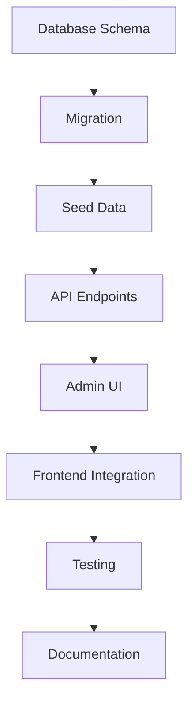
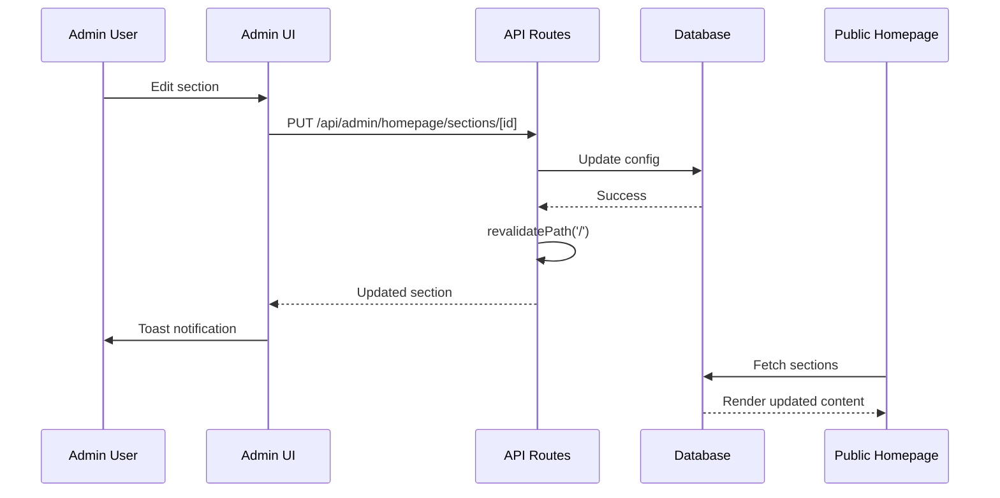
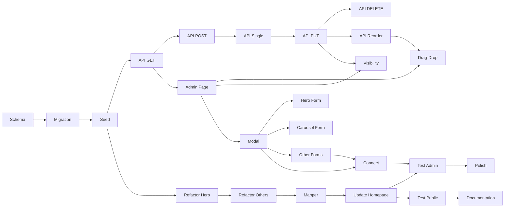

# Homepage CMS System - Implementation Roadmap

## Overview
This document provides a quick visual reference for implementing the Homepage CMS system.

---

## 🗺️ Implementation Flow



---

## 📦 Component Architecture

```
┌─────────────────────────────────────────┐
│         Admin Panel (/admin/homepage)    │
├─────────────────────────────────────────┤
│  ┌─────────────────────────────────┐   │
│  │  Section List (Drag-Drop)        │   │
│  │  ┌────────────────────────────┐ │   │
│  │  │ [≡] Hero Section  👁️ ✏️    │ │   │
│  │  ├────────────────────────────┤ │   │
│  │  │ [≡] Brand Story   👁️ ✏️    │ │   │
│  │  ├────────────────────────────┤ │   │
│  │  │ [≡] Carousel      👁️ ✏️    │ │   │
│  │  └────────────────────────────┘ │   │
│  └─────────────────────────────────┘   │
│                                         │
│  ┌─────────────────────────────────┐   │
│  │  Section Editor Modal            │   │
│  │  - Dynamic forms per type        │   │
│  │  - Validation                    │   │
│  │  - Image upload                  │   │
│  │  - Array management              │   │
│  └─────────────────────────────────┘   │
└─────────────────────────────────────────┘
```

---

## 🔄 Data Flow



---

## 📁 File Structure

```
project-root/
├── prisma/
│   ├── schema.prisma                      [ADD PageSection model]
│   └── migrations/
│       └── [timestamp]_add_page_section/  [NEW]
├── scripts/
│   └── seed-homepage-sections.ts          [NEW]
├── src/
│   ├── app/
│   │   ├── (public)/
│   │   │   └── page.tsx                   [MODIFY - fetch sections]
│   │   ├── api/
│   │   │   └── admin/
│   │   │       └── homepage/
│   │   │           └── sections/
│   │   │               ├── route.ts       [NEW - GET, POST]
│   │   │               ├── [id]/
│   │   │               │   └── route.ts   [NEW - GET, PUT, DELETE]
│   │   │               └── reorder/
│   │   │                   └── route.ts   [NEW - PUT]
│   │   └── admin/
│   │       └── homepage/
│   │           └── page.tsx               [NEW]
│   └── components/
│       ├── DynamicSection.tsx             [NEW - mapper]
│       ├── admin/
│       │   ├── AdminLayoutClient.tsx      [MODIFY - add nav link]
│       │   └── homepage/
│       │       └── SectionEditorModal.tsx [NEW]
│       └── sections/
│           ├── HeroSection.tsx            [MODIFY - add props]
│           ├── BrandCarouselSection.tsx   [VERIFY - has props]
│           ├── BrandStorySection.tsx      [MODIFY - add props]
│           ├── CategoriesSection.tsx      [MODIFY - add props]
│           └── PrecisionManufacturingSection.tsx [MODIFY - add props]
└── docs/
    └── 04-Implementation/
        ├── Homepage-CMS-Planning.md       [NEW]
        ├── Homepage-CMS-Roadmap.md        [NEW]
        └── Homepage-CMS-System.md         [NEW - final docs]
```

---

## 🎯 Task Dependency Graph



---

## ⚡ Quick Start Commands

### 1. Database Setup
```bash
# Add model to schema.prisma
# Then run:
npx prisma format
npx prisma migrate dev --name add_page_section_model
npm run seed-homepage  # or: node --loader ts-node/esm scripts/seed-homepage-sections.ts
```

### 2. Install Dependencies
```bash
npm install @dnd-kit/core @dnd-kit/sortable @dnd-kit/utilities
```

### 3. Development
```bash
npm run dev
# Access admin: http://localhost:3000/admin/homepage
```

### 4. Testing
```bash
# Manual testing checklist:
# 1. List sections
# 2. Drag to reorder
# 3. Toggle visibility
# 4. Edit hero section
# 5. Edit carousel
# 6. View public homepage
```

---

## 🔍 Key Code Patterns

### 1. API Route Pattern
```typescript
// src/app/api/admin/homepage/sections/route.ts
import { requireAdmin } from '@/lib/auth'
import { NextRequest, NextResponse } from 'next/server'
import { prisma } from '@/lib/prisma'

export async function GET(req: NextRequest) {
  await requireAdmin()
  
  try {
    const sections = await prisma.pageSection.findMany({
      where: { page: { slug: 'home' } },
      orderBy: { position: 'asc' }
    })
    return NextResponse.json(sections)
  } catch (error) {
    return NextResponse.json({ error: 'Failed to fetch' }, { status: 500 })
  }
}
```

### 2. Component Props Pattern
```typescript
// src/components/sections/HeroSection.tsx
interface HeroSectionProps {
  title?: string
  subtitle?: string
  cta1?: { text: string; link: string }
  cta2?: { text: string; link: string }
  badgeText?: string
}

export default function HeroSection({ 
  title = "Default Title",
  subtitle = "Default Subtitle",
  // ... rest with defaults
}: HeroSectionProps = {}) {
  // Use prop values
}
```

### 3. Drag-Drop Pattern
```typescript
import { DndContext, DragEndEvent } from '@dnd-kit/core'
import { SortableContext, arrayMove } from '@dnd-kit/sortable'

function handleDragEnd(event: DragEndEvent) {
  const { active, over } = event
  if (over && active.id !== over.id) {
    const oldIndex = sections.findIndex(s => s.id === active.id)
    const newIndex = sections.findIndex(s => s.id === over.id)
    
    const newSections = arrayMove(sections, oldIndex, newIndex)
    setSections(newSections)  // Optimistic update
    
    // Call reorder API
    await fetch('/api/admin/homepage/sections/reorder', {
      method: 'PUT',
      body: JSON.stringify({
        sections: newSections.map((s, i) => ({ id: s.id, position: i }))
      })
    })
  }
}
```

### 4. Dynamic Section Mapper Pattern
```typescript
// src/components/DynamicSection.tsx
export default function DynamicSection({ type, config }: Props) {
  switch (type) {
    case 'hero':
      return <HeroSection {...config} />
    case 'carousel':
      return <BrandCarouselSection {...config} />
    // ... other cases
    default:
      console.warn(`Unknown section type: ${type}`)
      return null
  }
}
```

---

## 🚦 Implementation Checkpoints

### Checkpoint 1: Database Ready
- [ ] Schema updated
- [ ] Migration applied
- [ ] Seed script runs
- [ ] Can query page_sections table

### Checkpoint 2: API Functional
- [ ] All 7 endpoints implemented
- [ ] Validation works
- [ ] Returns correct status codes
- [ ] Activity logging works

### Checkpoint 3: Admin UI Works
- [ ] Can access /admin/homepage
- [ ] Sections list displays
- [ ] Drag-drop reorders
- [ ] Visibility toggles work
- [ ] Modal opens on edit

### Checkpoint 4: Section Editors Work
- [ ] Hero form saves correctly
- [ ] Carousel form adds/removes images
- [ ] Other forms save correctly
- [ ] Validation prevents bad data

### Checkpoint 5: Frontend Updated
- [ ] Components accept props
- [ ] Mapper works for all types
- [ ] Homepage fetches from DB
- [ ] Fallback works
- [ ] Styling preserved

### Checkpoint 6: Complete
- [ ] All tests pass
- [ ] Public homepage reflects changes
- [ ] No console errors
- [ ] Documentation created
- [ ] Nav link added

---

## 🐛 Troubleshooting Guide

### Issue: Migration Fails
**Solution:** Check schema syntax, ensure PostgreSQL running

### Issue: Sections Not Displaying
**Solution:** Check seed script ran, verify database has sections

### Issue: Drag-Drop Not Working
**Solution:** Verify @dnd-kit packages installed, check console for errors

### Issue: Config Not Saving
**Solution:** Check API validation, verify JSON structure matches schema

### Issue: Public Homepage Shows Old Content
**Solution:** Verify revalidatePath called, check cache settings

### Issue: Images Not Loading
**Solution:** Verify MinIO URLs correct, check CORS settings

---

## 📊 Success Metrics

- ✅ All 25 tasks completed
- ✅ Zero console errors
- ✅ All CRUD operations work
- ✅ Homepage dynamically renders
- ✅ Mobile responsive
- ✅ Admin UX intuitive
- ✅ Documentation complete

---

**Last Updated:** November 5, 2025  
**Status:** Ready for Implementation
