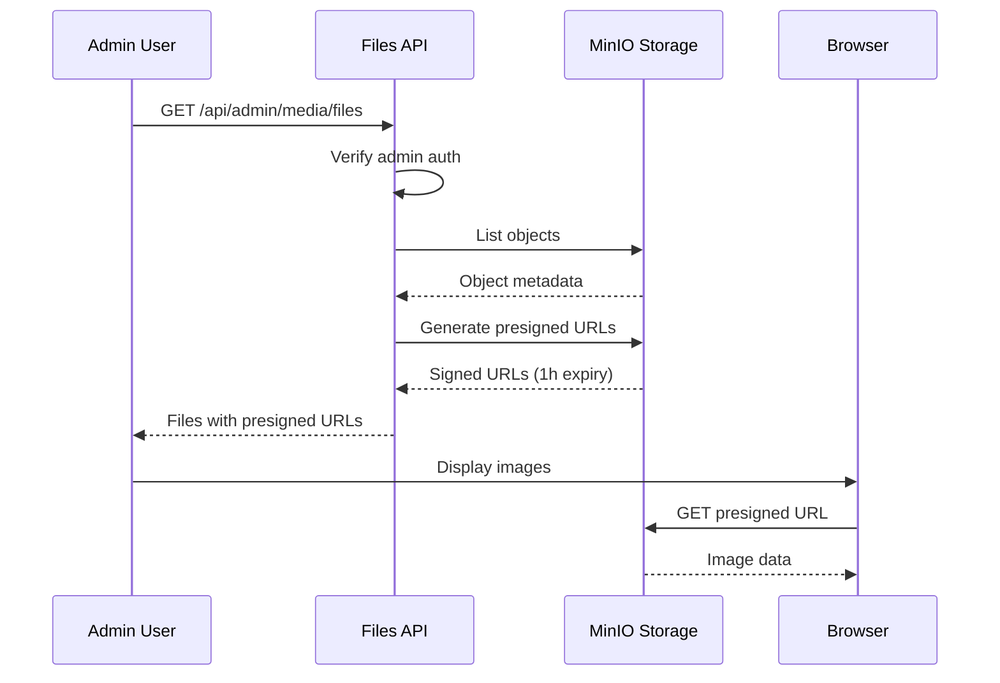

# MinIO Image Display Fix - Presigned URLs

**Date:** January 17, 2025  
**Issue:** Images not displaying as thumbnails in Media Library admin panel  
**Status:** ✅ RESOLVED (Secure Solution)

---

## Problem

After implementing Phase 14.5 (single bucket architecture), images uploaded to MinIO were not displaying as thumbnails in the admin panel's Media Library. The FileCard component showed broken images instead of previews.

### Symptoms
- ✅ Files uploaded successfully to MinIO
- ✅ URLs generated correctly
- ❌ Image thumbnails not rendering in admin panel
- ❌ Browser console showing 403 Forbidden errors

---

## Root Cause

MinIO bucket **was not configured with public read access**. By default, MinIO buckets are private, requiring authentication for all requests. The Next.js Image component couldn't load images because no presigned URLs were being generated.

---

## Solution: Presigned URLs (Secure Approach)

Since this is a **showcase website** (not e-commerce), images don't need to be publicly accessible. We implemented **presigned URLs** for secure, temporary access.

### What Are Presigned URLs?

Presigned URLs are temporary, authenticated URLs that:
- Expire after a set time (1 hour in our case)
- Include authentication tokens in the URL query parameters
- Allow secure access to private objects
- Are regenerated on each API request

### Implementation

**Updated:** `src/app/api/admin/media/files/route.ts`

```typescript
// Generate presigned URL (valid for 1 hour)
const url = await getPresignedUrl(obj.key, 3600);
```

**Security Script:** `scripts/set-minio-bucket-private.ts`

Removes public policy to ensure bucket stays private:

```typescript
const command = new DeleteBucketPolicyCommand({
  Bucket: BUCKET_NAME,
});
await s3Client.send(command);
```

---

## What Changed

### Before
- Bucket policy: Private (default)
- GET requests: Required authentication
- Image display: ❌ Failed with 403 Forbidden
- Security: ✅ Secure but not functional

### After
- Bucket policy: **Private (secure)**
- GET requests: **Use presigned URLs with tokens**
- Image display: ✅ **Working with 1-hour expiration**
- Security: ✅ **Secure and functional**

---

## Security Benefits

### Why Presigned URLs Are Better for Showcase Sites

1. **No Public Access**
   - Files remain private in MinIO
   - Cannot be accessed without authentication
   - URLs cannot be shared permanently

2. **Time-Limited Access**
   - URLs expire after 1 hour
   - Old URLs become invalid automatically
   - Must go through API to get fresh URLs

3. **Token-Based Security**
   - Each URL includes AWS signature
   - Prevents unauthorized access
   - Tampering invalidates the URL

4. **Admin-Only Control**
   - Only authenticated admins can generate URLs
   - Listing files requires admin auth
   - Upload/delete require admin auth

---

## How It Works



### URL Example

```
http://localhost:9000/garritwulf-media/products/image.jpg
  ?X-Amz-Algorithm=AWS4-HMAC-SHA256
  &X-Amz-Credential=...
  &X-Amz-Date=20250117T120000Z
  &X-Amz-Expires=3600
  &X-Amz-SignedHeaders=host
  &X-Amz-Signature=...
```

---

## Running the Scripts

### Set Bucket to Private (Secure)
```bash
npx tsx scripts/set-minio-bucket-private.ts
```

### Set Bucket to Public (NOT Recommended)
```bash
npx tsx scripts/set-minio-bucket-public.ts
```

**Note:** For showcase websites, always use private bucket with presigned URLs.

---

## Next.js Image Configuration

Updated in `next.config.ts` to support presigned URLs:

```typescript
images: {
  remotePatterns: [
    {
      protocol: 'http',
      hostname: 'localhost',
      port: '9000',
      pathname: '/**',
    },
  ],
  // Allow MinIO presigned URLs with query parameters
  dangerouslyAllowSVG: true,
  contentDispositionType: 'attachment',
}
```

---

## Testing

### Manual Test
1. Go to `/admin/media`
2. Upload an image
3. Verify thumbnail displays in FileCard
4. Check browser DevTools - URL should have query parameters

### Presigned URL Verification
1. Copy image URL from browser DevTools
2. Should contain `X-Amz-*` query parameters
3. URL works for 1 hour, then expires
4. After expiration, refresh page to get new URL

---

## Troubleshooting

### Images Still Not Showing?

1. **Check bucket is private:**
   ```bash
   npx tsx scripts/set-minio-bucket-private.ts
   ```

2. **Verify MinIO is running:**
   ```bash
   docker ps | findstr minio
   ```

3. **Check API logs:**
   - Presigned URLs should be generated in API response
   - Look for `getPresignedUrl` calls in server logs

4. **Restart dev server:**
   ```bash
   npm run dev
   ```

5. **Clear browser cache:**
   - Hard refresh (Ctrl+Shift+R)
   - Try incognito mode

### URLs Expiring Too Fast?

Increase expiration time in `src/app/api/admin/media/files/route.ts`:

```typescript
// Generate presigned URL (valid for 24 hours)
const url = await getPresignedUrl(obj.key, 86400);
```

---

## Related Files

- `scripts/set-minio-bucket-private.ts` - Set bucket to private (recommended)
- `scripts/set-minio-bucket-public.ts` - Set bucket to public (not recommended)
- `src/lib/minio.ts` - MinIO client with `getPresignedUrl()` function
- `src/app/api/admin/media/files/route.ts` - File listing API with presigned URLs
- `src/components/admin/media/FileCard.tsx` - Image thumbnail component
- `next.config.ts` - Next.js Image optimization config

---

## Comparison: Public vs Presigned URLs

| Feature | Public Bucket | Presigned URLs (Our Choice) |
|---------|---------------|----------------------------|
| Security | ❌ Low | ✅ High |
| URL Sharing | Permanent | Time-limited (1 hour) |
| Access Control | None | Token-based |
| Admin Auth Required | No | Yes |
| Best For | E-commerce product images | Showcase/portfolio sites |
| Our Implementation | ❌ Not used | ✅ **Active** |

---

## Conclusion

✅ **Images now display securely in Media Library admin panel**

The issue was resolved by implementing **presigned URLs** instead of public bucket access. This is the recommended approach for showcase websites because:

- Images remain private and secure
- Access is time-limited (1 hour expiration)
- Only authenticated admins can view images
- URLs cannot be permanently shared
- Better security posture overall

For e-commerce sites where products need to be publicly visible, the public bucket approach (`set-minio-bucket-public.ts`) would be more appropriate. But for showcase/portfolio websites, presigned URLs provide the right balance of functionality and security.
