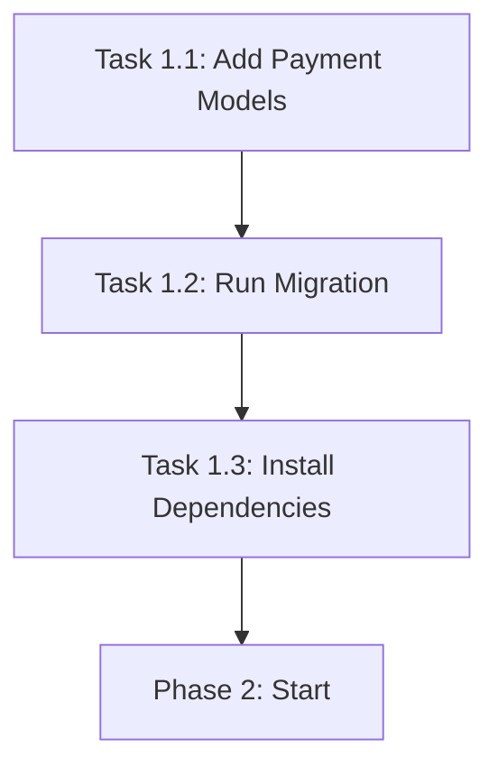

# Phase 1: Database & Infrastructure Setup

**Status:** 🔴 Not Started  
**Priority:** Critical  
**Dependencies:** None  
**Estimated Time:** 1-2 hours

---

## 📋 Overview

This phase establishes the foundational database schema and installs necessary dependencies for secure payment processing. It creates the data models required to store payment transactions, webhook logs, and refunds while maintaining PCI DSS compliance.

---

## 🎯 Objectives

1. ✅ Add Payment, WebhookLog, and Refund models to Prisma schema
2. ✅ Create and apply database migrations
3. ✅ Install Stripe SDK and payment dependencies
4. ✅ Ensure backward compatibility with existing Order model
5. ✅ Verify TypeScript types generated correctly

---

## 📊 Tasks Breakdown

### Task 1.1: Database Schema - Add Payment Models

**Description:** Add Payment, WebhookLog, and Refund models with proper enums and relations

**Files to Modify:**
- `prisma/schema.prisma`

**Implementation Steps:**

1. **Add Payment Provider Enum**
```prisma
enum PaymentProvider {
  STRIPE
  PAYPAL
  SQUARE
}
```

2. **Add Payment Status Enum**
```prisma
enum PaymentStatus {
  PENDING
  PROCESSING
  SUCCEEDED
  FAILED
  CANCELLED
  REFUNDED
  PARTIALLY_REFUNDED
}
```

3. **Add Refund Status Enum**
```prisma
enum RefundStatus {
  PENDING
  SUCCEEDED
  FAILED
}
```

4. **Add Payment Model**
```prisma
model Payment {
  id                 String          @id @default(cuid())
  orderId            String?         // Nullable for standalone payments
  provider           PaymentProvider
  providerPaymentId  String          @unique // Stripe: pi_xxx, PayPal: order_id
  providerCustomerId String?         // For recurring payments
  
  // Amount details
  amount             Decimal         @db.Decimal(10, 2)
  currency           String          @default("AED")
  status             PaymentStatus   @default(PENDING)
  
  // PCI Compliant - Only tokenized data
  paymentMethod      Json?           // {type: "card", last4: "4242", brand: "visa", exp_month: 12, exp_year: 2025}
  metadata           Json?           // Additional provider data
  
  // Error handling
  failureReason      String?         @db.Text
  failureCode        String?
  
  // Security & Audit
  idempotencyKey     String          @unique
  ipAddress          String?
  userAgent          String?         @db.Text
  
  // Timestamps
  createdAt          DateTime        @default(now())
  updatedAt          DateTime        @updatedAt
  
  // Relations
  order              Order?          @relation(fields: [orderId], references: [id])
  refunds            Refund[]
  webhookLogs        WebhookLog[]    @relation("PaymentWebhooks")
  
  @@index([status])
  @@index([provider])
  @@index([orderId])
  @@index([createdAt])
  @@map("payments")
}
```

5. **Add WebhookLog Model**
```prisma
model WebhookLog {
  id          String          @id @default(cuid())
  paymentId   String?         // Nullable if not payment-related
  provider    PaymentProvider
  eventType   String          // e.g., "payment_intent.succeeded"
  eventId     String          @unique // Provider's unique event ID (prevents replay)
  
  // Request details
  payload     Json            // Full webhook payload
  signature   String          @db.Text // Request signature
  headers     Json?           // Request headers
  
  // Processing status
  verified    Boolean         @default(false)
  processed   Boolean         @default(false)
  processedAt DateTime?
  
  // Error handling
  error       String?         @db.Text
  retryCount  Int             @default(0)
  
  // Timestamps
  createdAt   DateTime        @default(now())
  
  // Relations
  payment     Payment?        @relation("PaymentWebhooks", fields: [paymentId], references: [id])
  
  @@index([eventId])
  @@index([provider])
  @@index([processed])
  @@index([createdAt])
  @@map("webhook_logs")
}
```

6. **Add Refund Model**
```prisma
model Refund {
  id               String       @id @default(cuid())
  paymentId        String
  providerRefundId String       @unique // Stripe refund ID
  
  // Refund details
  amount           Decimal      @db.Decimal(10, 2)
  currency         String       @default("AED")
  reason           String?      @db.Text
  status           RefundStatus @default(PENDING)
  
  // Metadata
  metadata         Json?
  failureReason    String?      @db.Text
  
  // Audit
  initiatedBy      String?      // User ID who initiated refund
  
  // Timestamps
  createdAt        DateTime     @default(now())
  updatedAt        DateTime     @updatedAt
  
  // Relations
  payment          Payment      @relation(fields: [paymentId], references: [id], onDelete: Cascade)
  
  @@index([paymentId])
  @@index([status])
  @@map("refunds")
}
```

7. **Update Order Model** (Add payment relation)
```prisma
model Order {
  // ... existing fields ...
  
  payments Payment[] // Add this relation
  
  // ... existing relations ...
}
```

**Verification:**
- [ ] Schema compiles without errors
- [ ] All enums defined correctly
- [ ] Relations properly set up
- [ ] Indexes on key fields
- [ ] No breaking changes to existing models

---

### Task 1.2: Run Database Migration

**Description:** Create and apply Prisma migration for payment tables

**Commands to Run:**
```bash
# Generate migration
npx prisma migrate dev --name add_payment_system

# Verify migration
npx prisma migrate status

# Generate Prisma Client
npx prisma generate

# Verify in Prisma Studio
npx prisma studio
```

**Verification:**
- [ ] Migration file created in `prisma/migrations/`
- [ ] Migration applied successfully to database
- [ ] Tables created: `payments`, `webhook_logs`, `refunds`
- [ ] Foreign keys and indexes created
- [ ] Prisma Client regenerated with new types
- [ ] No data loss in existing tables (Order, Customer, etc.)

**Rollback Plan (if needed):**
```bash
# Rollback last migration
npx prisma migrate resolve --rolled-back [migration_name]

# Reset database (WARNING: deletes all data)
npx prisma migrate reset
```

---

### Task 1.3: Install Payment Dependencies

**Description:** Add Stripe and payment processing packages

**Packages to Install:**
```bash
npm install stripe@^18.0.0 @stripe/stripe-js@^6.0.0 @stripe/react-stripe-js@^3.0.0
```

**Package Details:**

| Package | Version | Purpose |
|---------|---------|---------|
| `stripe` | ^18.0.0 | Stripe Node.js SDK (server-side) |
| `@stripe/stripe-js` | ^6.0.0 | Stripe.js library (client-side) |
| `@stripe/react-stripe-js` | ^3.0.0 | React components for Stripe Elements |

**Verification:**
- [ ] `package.json` updated with new dependencies
- [ ] `package-lock.json` updated
- [ ] No breaking version conflicts
- [ ] `node_modules` contains new packages
- [ ] Run `npm audit` - no critical vulnerabilities
- [ ] TypeScript types available for all packages

**Security Check:**
```bash
# Check for vulnerabilities
npm audit

# Fix if needed
npm audit fix
```

---

## 🔄 Dependencies Between Tasks



**Sequential Order:** Must be executed in order (1.1 → 1.2 → 1.3)

---

## ✅ Phase Completion Checklist

### Database
- [ ] Payment model added to schema
- [ ] WebhookLog model added
- [ ] Refund model added
- [ ] Enums defined correctly
- [ ] Migration created and applied
- [ ] Tables visible in database
- [ ] Foreign keys working
- [ ] Indexes created

### Dependencies
- [ ] Stripe SDK installed
- [ ] Stripe.js installed
- [ ] React Stripe installed
- [ ] No dependency conflicts
- [ ] TypeScript types available
- [ ] No security vulnerabilities

### Verification
- [ ] `npx prisma generate` succeeds
- [ ] TypeScript compilation succeeds
- [ ] Prisma Studio shows new tables
- [ ] Existing data intact
- [ ] Ready for Phase 2

---

## 🔐 Security Considerations

### PCI DSS Compliance
- ✅ **Never store CVV/CVC:** Not in schema
- ✅ **Never store full PAN:** Only last4 in JSON
- ✅ **Tokenization:** Use provider IDs only
- ✅ **Encryption:** Sensitive keys handled separately

### Data Retention
- Payment data: Keep indefinitely for accounting
- Webhook logs: Rotate after 90 days
- Refund data: Keep indefinitely for audits

---

## 🐛 Troubleshooting

### Issue: Migration fails
**Solution:**
```bash
# Check database connection
npx prisma db pull

# Fix schema issues
npx prisma validate

# Force reset (WARNING: deletes data)
npx prisma migrate reset
```

### Issue: Prisma Client not updated
**Solution:**
```bash
# Regenerate client
npx prisma generate

# Restart TypeScript server in VS Code
# Ctrl+Shift+P > "TypeScript: Restart TS Server"
```

### Issue: Type errors after migration
**Solution:**
```bash
# Clear node_modules and reinstall
rm -rf node_modules package-lock.json
npm install
npx prisma generate
```

---

## 📚 Additional Resources

- [Prisma Schema Documentation](https://www.prisma.io/docs/concepts/components/prisma-schema)
- [Prisma Migrations Guide](https://www.prisma.io/docs/concepts/components/prisma-migrate)
- [Stripe API Overview](https://stripe.com/docs/api)
- [PCI DSS Data Storage Requirements](https://www.pcisecuritystandards.org/document_library)

---

## 📝 Notes

- Keep existing Order, Customer, OrderItem models unchanged
- Payment model links to Order but can exist independently
- WebhookLog tracks ALL webhook events (not just payments)
- Refund model allows partial refunds (amount field)
- All monetary values use Decimal(10, 2) for precision

---

**Next Phase:** [Phase 2: Core Security Libraries](./Phase-2-Core-Security.md)

**Status Update:** Ready to begin once approved
