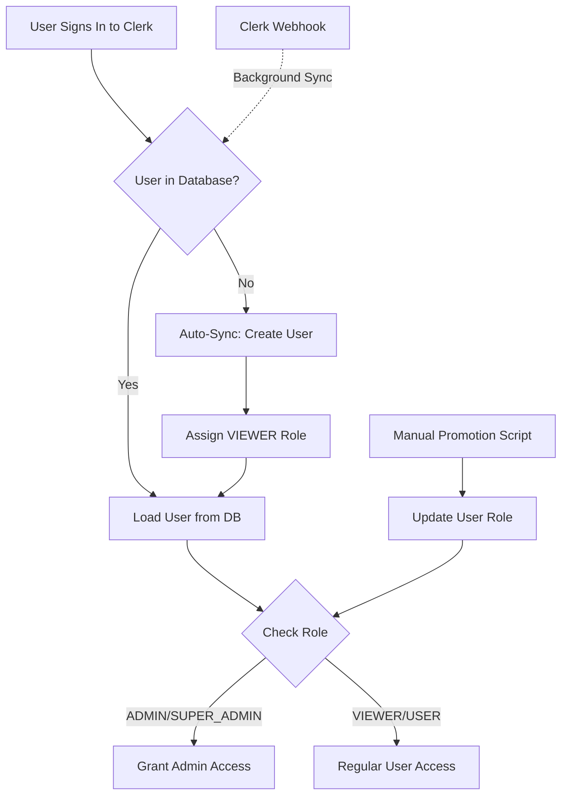

# Database Migration Guide - Future-Proof User Management

## 🎯 Overview

This guide ensures your database migrations don't break user authentication or admin access.

---

## 🚨 Critical Issue: User Data Loss During Migrations

**Problem**: When you modify Prisma schema and run migrations, user data can be lost, breaking authentication.

**Why This Happens**:

- Migrations can reset tables if not handled properly
- Clerk webhooks might not re-sync users automatically
- Admin users lose their roles after schema changes

---

## ✅ Solution: Auto-Sync + Seed Protection

We've implemented a **dual-layer protection system**:

### 1. **Auto-Sync Mechanism** (Primary Defense)

- Located in: `src/lib/auth.ts` → `getCurrentUser()`
- **What it does**: Automatically creates users in the database if they exist in Clerk but not in the DB
- **When it activates**: Every time a user tries to access the site
- **Default role**: New users get `VIEWER` role
- **Benefit**: System works even if webhooks fail or database is wiped

### 2. **Database Seed File** (Secondary Defense)

- Located in: `prisma/seed.ts`
- **What it does**: Preserves admin users during migrations
- **How to use**: Run after every migration

---

## 📋 Safe Migration Workflow

### **Step 1: Before Migration - Backup Admin Users**

```bash
# List current admin users
npx tsx scripts/list-users.ts

# Save the output - you'll need these emails/IDs
```

### **Step 2: Modify Schema**

Edit `prisma/schema.prisma` with your changes:

```prisma
model User {
  id        String   @id
  email     String   @unique
  name      String?
  role      UserRole @default(VIEWER)
  // Add your new fields here
  newField  String?  // Example
  createdAt DateTime @default(now())
  updatedAt DateTime @updatedAt
}
```

### **Step 3: Generate and Apply Migration**

```bash
# Generate migration
npx prisma migrate dev --name your_migration_name

# This might reset data - don't panic!
```

### **Step 4: Re-Sync Users (Automatic)**

**The system will automatically re-sync users when they log in!**

But if you want to manually restore admin roles:

```bash
# Promote user to admin
npx tsx scripts/setup-super-admin.ts --email=your@email.com
```

### **Step 5: Verify Everything Works**

```bash
# Check users in database
npx tsx scripts/list-users.ts

# You should see all users with correct roles
```

---

## 🔧 Common Migration Scenarios

### Scenario 1: Adding a New Field

```bash
# 1. Add field to schema
# 2. Run migration
npx prisma migrate dev --name add_phone_field

# 3. Users auto-sync on next login - no action needed!
```

### Scenario 2: Changing Field Type

```bash
# 1. Backup important data first
npx tsx scripts/list-users.ts > users_backup.txt

# 2. Modify schema
# 3. Run migration
npx prisma migrate dev --name change_role_enum

# 4. Restore admin access if needed
npx tsx scripts/setup-super-admin.ts --email=admin@example.com
```

### Scenario 3: Resetting Database Completely

```bash
# Nuclear option - complete reset
npx prisma migrate reset

# After reset:
# 1. Sign in to your app (creates user with VIEWER role)
# 2. Promote yourself to admin
npx tsx scripts/setup-super-admin.ts --email=your@email.com
```

---

## 🛡️ Auto-Sync Details

### How Auto-Sync Works

```typescript
// src/lib/auth.ts - getCurrentUser()

1. Check if user is authenticated in Clerk ✓
2. Look for user in database
   ├─ Found? → Return user
   └─ Not found? → Auto-create with VIEWER role
3. Log sync details to console
4. Return synced user
```

### Auto-Sync Logs

You'll see these in your terminal:

```
🔍 [getCurrentUser] Clerk userId: user_abc123
🔍 [getCurrentUser] Database user found: null
⚠️  [getCurrentUser] User authenticated in Clerk but not in database. Auto-syncing...
✅ [getCurrentUser] User auto-synced to database: john@example.com ( VIEWER )
ℹ️  [getCurrentUser] To promote to admin, run: npx tsx scripts/setup-super-admin.ts --email=john@example.com
```

---

## 📝 Admin User Management

### Creating First Admin

```bash
# Method 1: During migration
npx tsx scripts/sync-current-user.ts --id=user_xxx --email=your@email.com --promote

# Method 2: Promote existing user
npx tsx scripts/setup-super-admin.ts --email=your@email.com
```

### Promoting Multiple Admins

```bash
# List all users
npx tsx scripts/list-users.ts

# Promote specific users
npx tsx scripts/setup-super-admin.ts --email=admin1@example.com
npx tsx scripts/setup-super-admin.ts --email=admin2@example.com
```

### Demoting Admin (Manual)

```bash
# Use Prisma Studio
npx prisma studio

# Or create a demotion script if needed
```

---

## 🔄 Webhook Setup (Optional but Recommended)

While auto-sync handles missing users, webhooks provide real-time sync.

### Why Webhooks?

- ✅ Instant user creation (no login delay)
- ✅ Real-time email updates
- ✅ User deletion sync

### Setup Webhooks in Clerk

1. **Go to Clerk Dashboard**: https://dashboard.clerk.com
2. **Navigate to**: Webhooks → Add Endpoint
3. **Add Endpoint URL**:

   ```
   https://your-domain.com/api/webhooks/clerk

   # For local development with ngrok:
   https://your-ngrok-url.ngrok.io/api/webhooks/clerk
   ```

4. **Subscribe to Events**:
   - ✅ `user.created`
   - ✅ `user.updated`
   - ✅ `user.deleted`

5. **Copy Webhook Secret**:
   - Clerk shows: `whsec_xxxxxxxxxxxxx`
   - Add to `.env.local`:

   ```bash
   CLERK_WEBHOOK_SECRET=whsec_xxxxxxxxxxxxx
   ```

6. **Test Webhook**:
   - Create a new user in Clerk
   - Check terminal logs for webhook confirmation
   - Verify user appears in database

### Testing Webhooks Locally

```bash
# Install ngrok
npm install -g ngrok

# Start ngrok tunnel
ngrok http 3000

# Use the ngrok URL in Clerk webhook settings
# Example: https://abc123.ngrok.io/api/webhooks/clerk
```

---

## 🧪 Testing Your Setup

### Test 1: Auto-Sync Works

```bash
# 1. Clear database
npx prisma migrate reset

# 2. Go to http://localhost:3000
# 3. Sign in with existing Clerk account
# 4. Check terminal - should see auto-sync logs
# 5. Check database
npx tsx scripts/list-users.ts
# Should show your user with VIEWER role
```

### Test 2: Admin Access Works

```bash
# 1. Promote yourself
npx tsx scripts/setup-super-admin.ts --email=your@email.com

# 2. Go to http://localhost:3000/admin
# Should see admin dashboard (no redirect)
```

### Test 3: Migration Survives

```bash
# 1. Add a field to User model
# 2. Run migration
npx prisma migrate dev --name test_field

# 3. Sign in again
# 4. Check if user still exists
npx tsx scripts/list-users.ts
# Should show user with preserved role
```

---

## 🚨 Troubleshooting

### Problem: "Redirected from /admin to homepage"

**Cause**: User not in database or not admin role

**Fix**:

```bash
# Check your role
npx tsx scripts/list-users.ts

# If not admin:
npx tsx scripts/setup-super-admin.ts --email=your@email.com
```

### Problem: "No users in database after migration"

**Cause**: Migration reset tables

**Fix**: Just sign in! Auto-sync will recreate your user

```bash
# Then promote to admin
npx tsx scripts/setup-super-admin.ts --email=your@email.com
```

### Problem: "Webhook not working"

**Cause**: Missing or incorrect webhook secret

**Fix**:

1. Check `.env.local` has `CLERK_WEBHOOK_SECRET`
2. Verify secret matches Clerk dashboard
3. Test webhook endpoint: `/api/webhooks/clerk`
4. Check terminal logs for webhook errors

---

## 📊 System Architecture



---

## ✅ Best Practices

1. **Always backup admin emails** before major migrations
2. **Test migrations in development** first
3. **Use auto-sync as primary defense** (already implemented)
4. **Set up webhooks for production** (optional but recommended)
5. **Document custom migrations** in this file
6. **Keep seed file updated** with critical data
7. **Never commit** `.env.local` to git
8. **Monitor logs** during deployments

---

## 🎓 Summary

**You're now protected against data loss!**

✅ **Auto-sync** ensures users are always in the database
✅ **Manual scripts** let you restore admin access anytime
✅ **Webhooks** provide real-time sync (when configured)
✅ **Migration workflow** is documented and safe

**Key Takeaway**: Even if your database gets wiped, users will auto-sync on next login, and you can restore admin access with one command.

---

## 📞 Need Help?

Check the logs in your terminal - they show detailed sync information:

- 🔍 Debug logs (user lookups)
- ⚠️ Warnings (auto-sync triggered)
- ✅ Success logs (operations completed)
- ❌ Error logs (issues found)

Keep this guide handy for future migrations! 🚀
