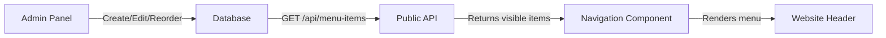

# Dynamic Menu System Integration

**Date:** 2025-01-30  
**Status:** ✅ Complete  
**Related Files:**
- `src/app/api/menu-items/route.ts` (NEW)
- `src/components/ui/Navigation.tsx` (UPDATED)

---

## Problem

The website navigation was **hardcoded** and not syncing with the admin panel's Menu Items management system:

```tsx
// OLD - Hardcoded
const navigationItems: NavigationItem[] = [
  { label: 'HOME', href: '/' },
  { label: 'PRODUCTS', href: '/products' },
  { label: 'ABOUT US', href: '/about' },
  { label: 'CONTACT US', href: '/contact' }
];
```

**Issues:**
- ❌ Changes in admin panel didn't affect the website
- ❌ Menu order couldn't be changed
- ❌ No way to add/remove menu items dynamically
- ❌ Menu items weren't stored in database

---

## Solution Implemented

### 1. Created Public API Endpoint

**File:** `src/app/api/menu-items/route.ts`

**Features:**
- Fetches only **visible** menu items
- Returns only **top-level** items (parentId === null)
- **Ordered by position** (ascending)
- Includes nested children (sub-menu items)
- Transforms data to navigation format
- Resolves page slugs and external URLs

```tsx
// Fetch visible menu items, ordered by position
const menuItems = await prisma.menuItem.findMany({
  where: {
    visible: true,
    parentId: null,
  },
  orderBy: {
    position: 'asc', // ← ORDER MATTERS!
  },
  include: {
    page: { select: { slug: true, title: true } },
    children: { /* nested items */ }
  }
});
```

### 2. Updated Navigation Component

**File:** `src/components/ui/Navigation.tsx`

**Changes:**
- ✅ Now fetches menu items from `/api/menu-items` on mount
- ✅ Uses React `useEffect` to load data
- ✅ Shows loading skeleton while fetching
- ✅ Fallback to hardcoded items if API fails
- ✅ Supports `openNewTab` attribute
- ✅ Dynamic rendering based on database

```tsx
const [navigationItems, setNavigationItems] = useState<NavigationItem[]>([]);
const [isLoading, setIsLoading] = useState(true);

useEffect(() => {
  const fetchMenuItems = async () => {
    const response = await fetch('/api/menu-items');
    const data = await response.json();
    setNavigationItems(data.menuItems || []);
  };
  fetchMenuItems();
}, []);
```

---

## How It Works

### Data Flow



### Menu Item Structure

```typescript
interface NavigationItem {
  id: string;
  label: string;           // "HOME", "PRODUCTS", etc.
  href: string;            // "/", "/products", "https://..."
  openNewTab?: boolean;    // Opens in new tab?
  children?: NavigationItem[]; // Sub-menu items
}
```

---

## Admin Panel → Website Sync

| Admin Action | Website Result |
|--------------|----------------|
| Create menu item | Appears in navigation |
| Reorder items | Changes menu order |
| Hide item (visible=false) | Removed from navigation |
| Delete item | Removed from navigation |
| Link to page | Uses page slug as href |
| External URL | Uses full URL as href |
| Open in new tab | Adds target="_blank" |

---

## Benefits

✅ **True Dynamic Menus:** Admin changes instantly reflect on website (after page reload)  
✅ **Proper Ordering:** Uses `position` field from database  
✅ **Visibility Control:** Only shows items marked as visible  
✅ **External Links:** Supports both pages and external URLs  
✅ **New Tab Control:** Respects `openNewTab` setting  
✅ **Loading States:** Shows skeleton while fetching  
✅ **Fallback:** Graceful degradation if API fails  

---

## Testing

### Test Menu Order Changes

1. Go to Admin Panel → Menu Items
2. Drag items to reorder
3. Click "Apply Changes"
4. Refresh website → Menu order should match

### Test Visibility

1. Edit menu item → Uncheck "Visible"
2. Save changes
3. Refresh website → Item should disappear

### Test New Items

1. Create new menu item
2. Set label and link
3. Save
4. Refresh website → New item appears in correct position

---

## Migration Notes

**Existing Websites:**
- Need to create menu items in admin panel for existing navigation
- Recommended menu items:
  ```
  Position 0: HOME → / (Internal Page)
  Position 1: PRODUCTS → /products (Internal Page)
  Position 2: ABOUT US → /about (Internal Page)
  Position 3: CONTACT US → /contact (Internal Page)
  ```

---

## Future Enhancements

1. **Real-time Updates:** Use WebSocket or polling for instant updates
2. **Mega Menus:** Support for complex nested menus with images
3. **Menu Caching:** Add Redis caching for performance
4. **Menu Templates:** Pre-defined menu structures
5. **Menu Analytics:** Track which menu items are clicked most

---

## Related Documentation

- [Menu Items UI Redesign](./Menu-Items-UI-Redesign.md)
- [Menu & Pages System Guide](../05-Features/Menu-Items-And-Pages-System-Guide.md)
