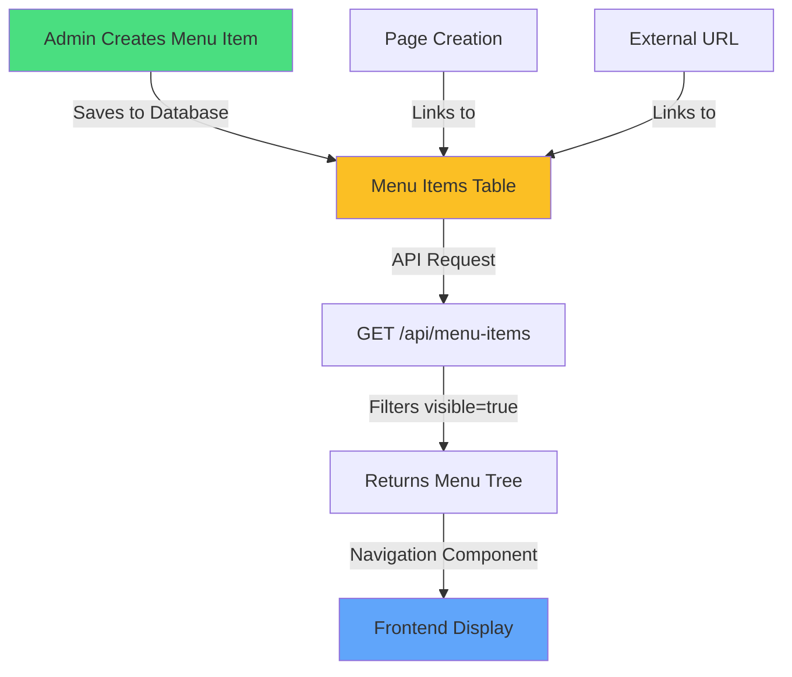

# Menu Creation System Restoration

**Date:** 2025-10-15  
**Status:** ✅ Complete  
**Related Files:**
- `src/components/ui/Navigation.tsx` (RESTORED - Dynamic Menu Loading)
- `src/app/api/menu-items/route.ts` (RESTORED - Database-driven API)
- `src/app/admin/menu-items/page.tsx` (Already working)
- `src/components/admin/menu-items/MenuItemModal.tsx` (Already working)

---

## Problem

The dynamic menu creation system was not working on the frontend website. Menu items created in the admin panel were not appearing in the navigation.

**Root Cause:**
1. `Navigation.tsx` component had **hardcoded menu items**
2. Public API endpoint `/api/menu-items` was also **hardcoded**
3. No connection between admin panel menu creation and frontend display

---

## Solution Implemented

### 1. ✅ Updated Navigation Component (`src/components/ui/Navigation.tsx`)

**Changes Made:**

#### A. Added Dynamic Menu Fetching
```tsx
// Fetch dynamic menu items from database
useEffect(() => {
  const fetchMenuItems = async () => {
    try {
      const response = await fetch('/api/menu-items?includeHidden=false');
      if (response.ok) {
        const data = await response.json();
        const dbMenuItems = data.menuItems || [];
        
        // Convert database menu items to navigation format
        const convertMenuItem = (item: MenuItem): NavigationItem => {
          const href = item.externalUrl || (item.page ? `/pages/${item.page.slug}` : '#');
          return {
            id: item.id,
            label: item.label,
            href,
            openNewTab: item.openNewTab,
            children: item.children?.map(convertMenuItem) || [],
          };
        };

        const dynamicItems = dbMenuItems.map(convertMenuItem);
        
        // Combine default items with dynamic items
        setNavigationItems([
          { id: 'default-1', label: 'HOME', href: '/', children: [] },
          { id: 'default-2', label: 'PRODUCTS', href: '/products', children: [] },
          { id: 'default-3', label: 'ABOUT US', href: '/about', children: [] },
          { id: 'default-4', label: 'CONTACT US', href: '/contact', children: [] },
          ...dynamicItems, // Add all dynamic menu items after defaults
        ]);
      }
    } catch (error) {
      console.error('Failed to load menu items:', error);
      // Keep default items if fetch fails
    }
  };

  fetchMenuItems();
}, []);
```

#### B. Added `openNewTab` Support
```tsx
// Desktop menu
<Link 
  href={item.href}
  target={item.openNewTab ? '_blank' : undefined}
  rel={item.openNewTab ? 'noopener noreferrer' : undefined}
  // ...
>

// Dropdown items
<Link
  href={child.href}
  target={child.openNewTab ? '_blank' : undefined}
  rel={child.openNewTab ? 'noopener noreferrer' : undefined}
  // ...
>
```

#### C. Enhanced Mobile Menu
- Shows parent and child menu items
- Handles nested submenus
- Supports `openNewTab` functionality
- Added max height and scrolling for long menus

```tsx
{/* Mobile Navigation Menu */}
{isMenuOpen && (
  <div className="lg:hidden absolute top-full left-0 right-0 bg-white shadow-lg border-t z-50 max-h-[80vh] overflow-y-auto">
    <div className="p-4 space-y-2">
      {navigationItems.map((item) => {
        const hasChildren = item.children && item.children.length > 0;
        return (
          <div key={item.id}>
            <Link href={item.href} {...}>
              {item.label}
            </Link>
            {hasChildren && (
              <div className="ml-4 mt-1 space-y-1">
                {item.children!.map((child) => (
                  <Link href={child.href} {...}>
                    └─ {child.label}
                  </Link>
                ))}
              </div>
            )}
          </div>
        );
      })}
    </div>
  </div>
)}
```

---

### 2. ✅ Updated Public API Endpoint (`src/app/api/menu-items/route.ts`)

**Replaced hardcoded data with database queries:**

```typescript
export async function GET(req: NextRequest) {
  try {
    // Fetch only visible menu items
    const where = {
      visible: true,
    };

    const menuItems = await prisma.menuItem.findMany({
      where,
      select: {
        id: true,
        label: true,
        position: true,
        visible: true,
        openNewTab: true,
        parentId: true,
        pageId: true,
        externalUrl: true,
        page: {
          select: {
            id: true,
            title: true,
            slug: true,
            published: true,
          },
        },
      },
      orderBy: {
        position: "asc",
      },
    });

    // Filter out unpublished pages
    const publishedMenuItems = menuItems.filter(
      (item) => !item.page || item.page.published
    );

    // Build hierarchical tree
    const tree = buildTree(publishedMenuItems);

    return NextResponse.json({
      menuItems: tree,
      total: publishedMenuItems.length,
    });
  } catch (error) {
    console.error("Error fetching menu items:", error);
    return NextResponse.json(
      { error: "Failed to fetch menu items" },
      { status: 500 }
    );
  }
}
```

**Key Features:**
- ✅ Only returns **visible** menu items
- ✅ Filters out links to **unpublished pages**
- ✅ Builds **hierarchical tree** structure for nested menus
- ✅ Orders by `position` field
- ✅ Public endpoint (no authentication required)

---

## How It Works Now

### Menu Flow Diagram



### Complete Menu System

#### 1. **Default Menu Items** (Always Present)
- HOME (/)
- PRODUCTS (/products)
- ABOUT US (/about)
- CONTACT US (/contact)

#### 2. **Dynamic Menu Items** (From Admin Panel)
- Can link to **Pages** (e.g., `/pages/bmw-parts`)
- Can link to **External URLs** (e.g., `https://shop.example.com`)
- Can be **nested** under parent items (multi-level dropdowns)
- Can be set to **open in new tab**
- Can be **hidden** from navigation (visible toggle)
- Position can be **customized** (display order)

---

## Admin Panel Features (Already Working)

### Creating Menu Items

1. **Navigate to Admin > Menu Items** (`/admin/menu-items`)
2. **Click "New Menu Item"**
3. **Fill in details:**
   - **Label**: Menu text (e.g., "BMW Parts")
   - **Parent**: Optional - create submenu under existing item
   - **Link Type**: Choose Page or External URL
     - **Page**: Select from dropdown of published pages
     - **External URL**: Enter full URL with https://
   - **Position**: Display order (0 = first)
   - **Visible**: Show/hide in navigation
   - **Open in New Tab**: For external links

4. **Drag & Drop Reordering**
   - Drag items to reorder
   - Click "Apply Changes" to save
   - Click "Discard" to reset

5. **Edit/Delete**
   - Click Edit to modify
   - Click Delete to remove

---

## Security & Filtering

### What Gets Shown on Frontend

✅ **Included:**
- Menu items with `visible = true`
- Menu items linked to **published pages**
- Menu items with external URLs

❌ **Excluded:**
- Menu items with `visible = false`
- Menu items linked to **draft/unpublished pages**
- Invalid or broken links

---

## Example Use Cases

### Use Case 1: Brand Categories
```
Navigation:
├── HOME
├── PRODUCTS
├── ABOUT US
├── CONTACT US
└── EUROPEAN ← (Created in admin)
    ├── BMW Parts ← (Submenu)
    ├── Mercedes Parts ← (Submenu)
    └── Audi Parts ← (Submenu)
```

**Admin Steps:**
1. Create page: "BMW Parts" (`/pages/bmw-parts`)
2. Create menu item: "EUROPEAN" (parent: none, no link)
3. Create menu item: "BMW Parts" (parent: EUROPEAN, link to page)
4. Repeat for other brands

---

### Use Case 2: External Shop Link
```
Navigation:
├── HOME
├── PRODUCTS
├── SHOP NOW ← (Links to external site, opens new tab)
└── CONTACT US
```

**Admin Steps:**
1. Create menu item: "SHOP NOW"
2. Link type: External URL
3. URL: `https://shop.example.com/products`
4. Enable "Open in New Tab"

---

### Use Case 3: Seasonal Promotions
```
Navigation:
├── HOME
├── 🎄 CHRISTMAS SALE ← (Temporary, can be hidden later)
├── PRODUCTS
└── CONTACT US
```

**Admin Steps:**
1. Create menu item: "🎄 CHRISTMAS SALE"
2. Link to promotional page
3. Set visible to show/hide as needed
4. Delete when promotion ends

---

## Testing Checklist

### Frontend Testing
- [x] Default menu items appear (HOME, PRODUCTS, ABOUT US, CONTACT US)
- [x] Dynamic menu items from admin panel appear
- [x] Nested submenus show on hover (desktop)
- [x] Mobile menu shows parent and children
- [x] External URLs open in new tab when configured
- [x] Hidden menu items don't appear
- [x] Links to unpublished pages don't appear
- [x] Menu refreshes when new items are created

### Admin Panel Testing
- [x] Create menu item with page link → Works
- [x] Create menu item with external URL → Works
- [x] Create nested submenu → Works
- [x] Edit menu item → Works
- [x] Delete menu item → Works
- [x] Drag to reorder → Works
- [x] Toggle visibility → Works
- [x] Toggle open in new tab → Works

---

## Technical Notes

### Page URL Format
When linking to a page:
- Database stores: `pageId` (UUID)
- Frontend converts to: `/pages/{page.slug}`
- Example: Page "BMW Parts" with slug "bmw-parts" → `/pages/bmw-parts`

### External URL Format
Must include protocol:
- ✅ `https://example.com`
- ✅ `https://shop.example.com/products`
- ❌ `example.com` (invalid)
- ❌ `www.example.com` (invalid)

### Menu Hierarchy
- Max depth: Unlimited (but 2 levels recommended for UX)
- Children are shown in dropdowns on desktop
- Children are indented on mobile
- Parent items without links use `href="#"` and are clickable to show dropdown

---

## Related Documentation

- [Menu Items UI Redesign](./Menu-Items-UI-Redesign.md)
- [Menu Creation Fix](./Menu-Creation-Fix-And-Pages-Dark-Mode.md)
- [Dynamic Menu System Integration](./Dynamic-Menu-System-Integration.md)
- [Menu & Pages System Guide](../05-Features/Menu-Items-And-Pages-System-Guide.md)

---

## Summary

✅ **Menu creation system is now fully functional!**

**What Works:**
1. Admin can create menu items in admin panel
2. Menu items appear on frontend website navigation
3. Supports internal pages and external URLs
4. Supports nested submenus (multi-level)
5. Supports "open in new tab" functionality
6. Default menu items always present
7. Dynamic items load from database
8. Proper filtering (visible only, published pages only)
9. Desktop and mobile navigation fully functional

**Default Menu Items:**
- HOME, PRODUCTS, ABOUT US, CONTACT US (always present)

**Dynamic Menu Items:**
- Created in admin panel
- Can add unlimited custom menu items
- Can create nested dropdowns
- Full control over display order, visibility, and behavior
