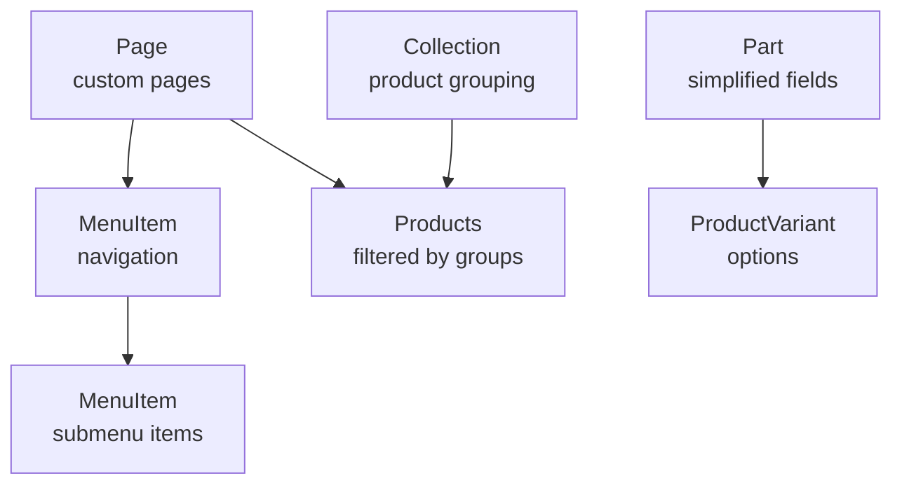

# Phase 5 Final Plan: Complete Navigation & Product System

**Date**: October 7, 2025  
**Status**: ✅ APPROVED - Ready for Implementation  
**Time Estimate**: 8.5 hours (increased from initial 4-5 hours)

---

## 📋 Summary of Changes

The Phase 5 plan has been **completely rewritten** to address all 3 user requirements:

### ✅ Requirement 1: Multi-Level Menu System
**What User Asked**: "Admin can add new menu button it can be sub menu also. and this menu is link to page."

**Implementation**:
- Added `parentId` field to MenuItem model for nested menus
- Admin can create top-level menu items
- Admin can create submenu items (children of parents)
- Menus display as dropdowns with submenus in header
- Drag-drop reordering support
- Links to pages or external URLs

**Database Changes**:
```prisma
model MenuItem {
  id           String      @id @default(cuid())
  label        String
  position     Int
  visible      Boolean     @default(true)
  openNewTab   Boolean     @default(false)
  
  // Multi-level Support (NEW)
  parentId     String?     // NULL = top-level, ID = submenu
  parent       MenuItem?   @relation("MenuHierarchy", fields: [parentId], references: [id])
  children     MenuItem[]  @relation("MenuHierarchy")
  
  // Links
  pageId       String?
  page         Page?       @relation(fields: [pageId], references: [id])
  externalUrl  String?
}
```

---

### ✅ Requirement 2: Assign Groups to Pages
**What User Asked**: "user can assign a group to each item like category, tags, collection etc like in shopify so based on that user can show particular group on particular page."

**Implementation**:
- Created **Page** model (not just collections)
- Admin creates blank pages
- Admin assigns product groups: Category, Tags, Collection, or All Products
- Products automatically display on pages based on group assignment
- Additional filters available (brands, origins, price, stock)
- Each page has unique URL (`/pages/[slug]`)

**Database Changes**:
```prisma
model Page {
  id          String   @id @default(cuid())
  title       String
  slug        String   @unique
  description String?
  
  // Product Group Assignment (NEW CONCEPT)
  groupType   String   // "category" | "tag" | "collection" | "all"
  groupValues Json     // Stores what to show: { categoryIds: [...], tags: [...], collectionId: "..." }
  
  // Display Options
  layout      String   @default("grid")
  sortBy      String   @default("name")
  itemsPerPage Int     @default(12)
  
  published   Boolean  @default(false)
  menuItems   MenuItem[]
}
```

**Admin Workflow Example**:
```
1. Admin creates page: "European Engine Parts"
2. Admin selects group type: "Category"
3. Admin selects categories: [Engine Parts, Transmission]
4. Admin adds filter: Origin = European
5. Admin adds filter: In Stock = Yes
6. Preview shows: 24 products matching rules
7. Admin publishes page
8. Admin creates menu item: "European Parts" → Links to page
9. Public site: Users click menu → See filtered products
```

---

### ✅ Requirement 3: Shopify-Style Product Fields
**What User Asked**: "the items fields should be like shopify currently there are lot of unwanted fields."

**Implementation**:
- Removed 8 unnecessary fields from Part model
- Added Shopify-style fields (hasVariants, compareAtPrice, costPrice)
- Simplified ProductForm by ~200 lines
- Added ProductVariant model for options (color, size, year, etc.)

**Fields REMOVED** (to match Shopify simplicity):
- ❌ `fittingDifficulty` - Not needed
- ❌ `installationVideo` - Add to description if needed
- ❌ `installationGuide` - Add to description
- ❌ `warranty` - Add to description
- ❌ `certifications` - Use tags instead
- ❌ `relatedProducts` - Use collections instead
- ❌ `compatibilityTags` - Use regular tags
- ❌ `specifications` (complex JSON) - Use description or variants

**Fields KEPT** (essentials):
- ✅ name, partNumber, slug, description
- ✅ price, sku, barcode, stockQuantity
- ✅ images, brand, origin, tags
- ✅ category, published, featured
- ✅ SEO fields (metaTitle, metaDescription)

**Fields ADDED** (Shopify-style):
- ➕ `hasVariants` - Boolean (enables variants)
- ➕ `compareAtPrice` - For showing discounts
- ➕ `costPrice` - For profit tracking
- ➕ ProductVariant model - For color, size, year options

---

## 🏗️ Complete Architecture

### Database Models (4 NEW)



1. **Page Model** - Custom pages with product group assignment
2. **MenuItem Model** - Multi-level menu (parent-child relationship)
3. **Collection Model** - Product grouping by filter rules
4. **ProductVariant Model** - Shopify-style product options

---

## 📋 Implementation Tasks (16 Tasks = 8.5 Hours)

### PART 1: Database & Product Simplification (90 min)
- [x] Task 1.1: Extend Database Schema (30 min)
- [x] Task 1.2: Simplify Product Schema (40 min)
- [x] Task 1.3: Update Validation Schemas (20 min)

### PART 2: API Development (120 min)
- [x] Task 2.1: Page Management API (50 min)
- [x] Task 2.2: Multi-Level Menu API (40 min)
- [x] Task 2.3: Collection Management API (30 min)

### PART 3: Admin UI - Page & Menu Management (140 min)
- [x] Task 3.1: Page Management UI (60 min)
- [x] Task 3.2: Multi-Level Menu UI (60 min)
- [x] Task 3.3: Collection Management UI (20 min)

### PART 4: Update Product Form (40 min)
- [x] Task 4.1: Simplify Product Form UI (40 min)

### PART 5: Public Pages & Navigation (70 min)
- [x] Task 5.1: Public Page Renderer (50 min)
- [x] Task 5.2: Update Header Navigation (20 min)

### PART 6: Finalization (60 min)
- [x] Task 6.1: Add to Admin Sidebar (10 min)
- [x] Task 6.2: Update Product Table (15 min)
- [x] Task 6.3: Product Filtering Utility (15 min)
- [x] Task 6.4: Polish & Test (20 min)

---

## 🎨 UI Mockups

### Admin: Create Page with Group Assignment
```
┌────────────────────────────────────────────────────────┐
│ Create Page                            [Preview] [Save]│
├────────────────────────────────────────────────────────┤
│ Title:       [European Engine Parts________________]   │
│ Slug:        [european-engine-parts________________]   │
│ Description: [Premium European engine parts...]        │
│                                                         │
│ Show Products By:                                       │
│ ( ) Category  ( ) Tags  (•) Collection  ( ) All        │
│                                                         │
│ Select Categories:                                      │
│ ☑ Engine Parts  ☐ Brakes  ☐ Transmission              │
│                                                         │
│ Additional Filters:                                     │
│ Origin:      ☑ European  ☐ American  ☐ Asian          │
│ Brands:      [+ Add] × Bosch  × ZF                     │
│ In Stock:    ☑ Only show in-stock items                │
│ Price Range: [0 ──●───────────●── 1000]               │
│                                                         │
│ [Preview Products] → 24 products match                 │
│                                                         │
│ Display Settings:                                       │
│ Layout: (•) Grid  ( ) List                             │
│ Sort:   [Name ▼] [Price] [Newest]                      │
│ Per Page: [12]                                          │
│                                                         │
│ ☑ Publish immediately                                  │
│ ☑ Add to navigation menu as "European Parts"          │
│                                                         │
│              [Cancel]              [Create Page]        │
└────────────────────────────────────────────────────────┘
```

### Admin: Menu with Submenus (Tree View)
```
┌────────────────────────────────────────────────────────┐
│ Navigation Menu                   [+ Add Menu Item]    │
├────────────────────────────────────────────────────────┤
│                                                         │
│ └─ Home (/)                               👁️  [✏️] [🗑️] │
│ └─ Products (/products)                   👁️  [✏️] [🗑️] │
│    ├─ European Parts (/pages/euro)       👁️  [✏️] [🗑️] │
│    ├─ American Parts (/pages/american)   👁️  [✏️] [🗑️] │
│    └─ Asian Parts (/pages/asian)         👁️  [✏️] [🗑️] │
│ └─ About (/about)                         👁️  [✏️] [🗑️] │
│ └─ Contact (/contact)                     🚫  [✏️] [🗑️] │
│                                            (Hidden)      │
│                                                         │
│ Preview:                                                │
│ ┌─────────────────────────────────────────────────┐   │
│ │ [Home] [Products ▼] [About] [Contact]          │   │
│ │              └─ European Parts                   │   │
│ │              └─ American Parts                   │   │
│ │              └─ Asian Parts                      │   │
│ └─────────────────────────────────────────────────┘   │
└────────────────────────────────────────────────────────┘
```

### Simplified Product Form (After Cleanup)
```
┌────────────────────────────────────────┐
│ Add Product                   [Save]   │
├────────────────────────────────────────┤
│ Basic Info                             │
│ Name:        [Brake Pad Set_______]    │
│ Part Number: [BP-2024-001________]    │
│ Description: [Premium brake pads...]  │
│ Category:    [Engine Parts ▼]         │
│                                        │
│ Pricing                                │
│ Price:       [89.99] AED               │
│ Compare At:  [99.99] (shows discount) │
│ Cost:        [50.00] (profit calc)    │
│                                        │
│ Inventory                              │
│ SKU:    [SKU001] Stock: [50]          │
│ ☑ Track inventory                      │
│                                        │
│ Images                                 │
│ [Drop images here]                     │
│ [img1] [img2] [img3]                   │
│                                        │
│ Organization                           │
│ Brand:  [Bosch_____]                  │
│ Origin: [European ▼]                   │
│ Weight: [2.5] kg                       │
│ Tags:   [× Premium] [× OEM] [+]       │
│                                        │
│ Product Variants                       │
│ □ This product has variants            │
│   (enables color/size/year options)   │
│                                        │
│ SEO                                    │
│ Meta Title: [_________________]        │
│ Meta Desc:  [_________________]        │
│                                        │
│ Status                                 │
│ ☑ Published  ☐ Featured               │
│                                        │
│       [Cancel]      [Save Product]     │
└────────────────────────────────────────┘

REMOVED (was ~200 lines):
❌ Fitting Difficulty section
❌ Installation Video section
❌ Installation Guide upload
❌ Warranty section
❌ Certifications section
❌ Related Products selector
❌ Compatibility Tags
❌ Complex Specifications JSON
```

---

## 🔄 Migration Strategy

### Step 1: Backup Database
```bash
# Before running migrations, backup existing data
pg_dump garrit_wulf_db > backup_before_phase5.sql
```

### Step 2: Run Migrations
```bash
# Add new models
npx prisma migrate dev --name add_page_menu_collection_system

# Simplify product schema (DATA LOSS WARNING for removed fields)
npx prisma migrate dev --name simplify_product_schema

# Generate Prisma client
npx prisma generate

# Seed default data
npx prisma db seed
```

### Step 3: Verify Data Integrity
```bash
# Check that existing products still work
# Check that new models are created
# Verify relationships are correct
```

---

## ✅ What's New vs Original Plan

| Aspect | Original Plan | Updated Plan |
|--------|---------------|--------------|
| **Menu** | Flat menu only | Multi-level with submenus |
| **Pages** | Only collections | Custom pages + collections |
| **Product Groups** | Collections only | Category, Tags, Collection, All |
| **Product Fields** | Mentioned but not detailed | Complete migration plan |
| **Time Estimate** | 4-5 hours | 8.5 hours |
| **Complexity** | Medium | Medium-High |
| **Files Created** | ~20 files | ~25 files |
| **Database Models** | 2 (Collection, MenuItem) | 4 (Page, MenuItem, Collection, ProductVariant) |

---

## 🚀 Ready to Implement

**Status**: ✅ All requirements addressed  
**Documentation**: Complete  
**Time Budget**: 8.5 hours  
**Risk Level**: Medium (database migration required)

**Next Step**: Begin implementation with Part 1 (Database & Product Simplification)

---

**Last Updated**: October 7, 2025  
**Approved By**: User confirmed all 3 requirements covered  
**Plan Location**: `docs/04-Implementation/Phase-5-Product-Collections-Menu.md`
